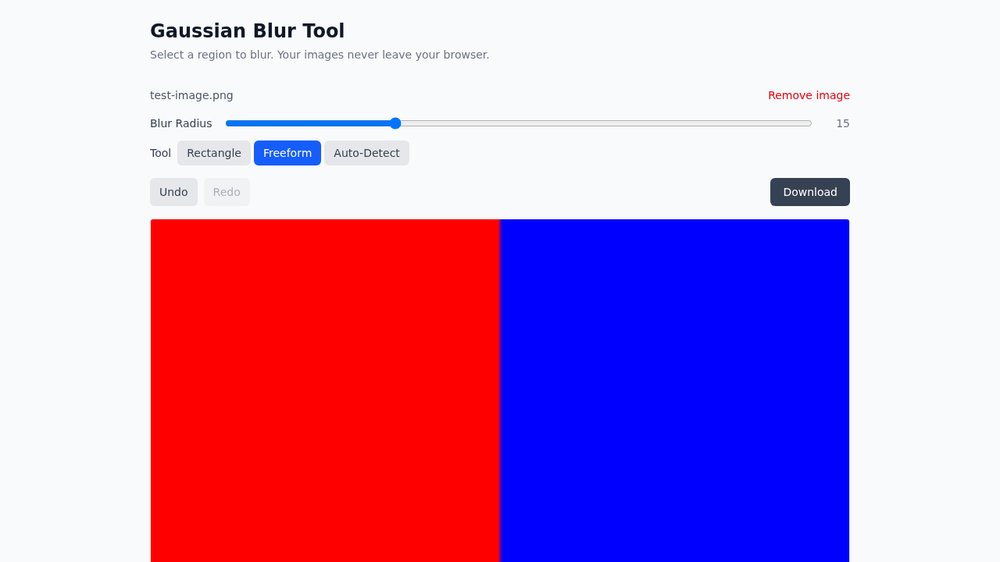

# Gaussian Blur Tool

A client-side image blur tool built with React, TypeScript, and Vite. Select regions of an image to apply a gaussian blur — your images never leave your browser.

**[Try it live](https://milesburton.github.io/gaussian-blur-tool/)**

## Features

- **Drag-and-drop upload** — drop an image or click to browse
- **Rectangle selection** — draw a box around the area to blur
- **Freeform selection** — draw arbitrary shapes for irregular regions
- **Auto-detect objects** — uses TensorFlow.js COCO-SSD to detect objects client-side; click to blur individual objects or all at once
- **Multiple blur regions** — apply blur to different areas sequentially
- **Undo/redo** — step back through edits with toolbar buttons or `Ctrl+Z` / `Ctrl+Shift+Z`
- **Adjustable blur radius** — control blur intensity with a slider (1–50)
- **Download** — export the result as PNG
- **Fully client-side** — no server, no uploads, complete privacy

## Screenshots

### Landing page


### Image loaded with tool controls


### Rectangle blur applied


### Freeform blur applied


### Multiple regions blurred


### After undo


## Getting started

```bash
npm install
npm run dev
```

## Scripts

| Command | Description |
|---|---|
| `npm run dev` | Start dev server |
| `npm run build` | Type-check and build for production |
| `npm run preview` | Preview production build |
| `npm run lint` | Run Biome linter |
| `npm run test` | Run unit tests |
| `npm run test:watch` | Run unit tests in watch mode |
| `npm run test:coverage` | Run unit tests with coverage |
| `npm run test:e2e` | Run Playwright visual regression tests |

## Testing

### Unit tests (Vitest)

44 tests covering:

- Gaussian blur kernel generation and convolution
- Point-in-polygon ray casting algorithm
- Selection mask creation for rectangles and freeform shapes
- Blur application with rectangular and freeform selections
- Component rendering and interactions (DropZone, BlurControls)
- Undo/redo history hook

### E2E tests (Playwright)

9 visual regression tests with baseline screenshots:

- Landing page rendering
- Image upload with tool controls
- Rectangle blur selection and application
- Freeform blur selection and application
- Undo/redo workflows
- Multiple blur regions
- Blur radius adjustment
- Image removal

## Tech stack

- React 19 + TypeScript 5.9
- Vite 8
- Tailwind CSS v4
- TensorFlow.js + COCO-SSD (client-side object detection)
- Biome (linting/formatting)
- Husky + commitlint + lint-staged
- Vitest + Testing Library
- Playwright
