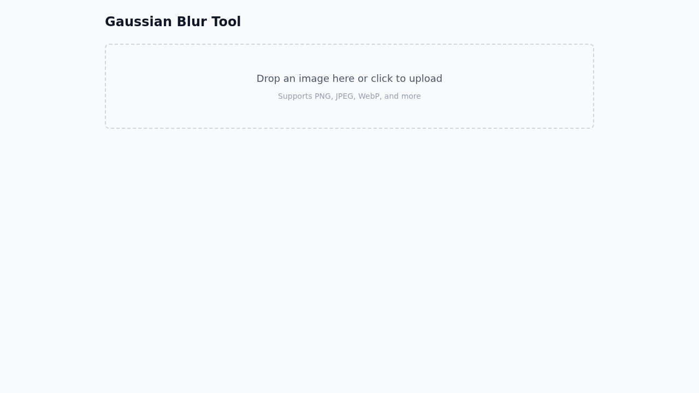
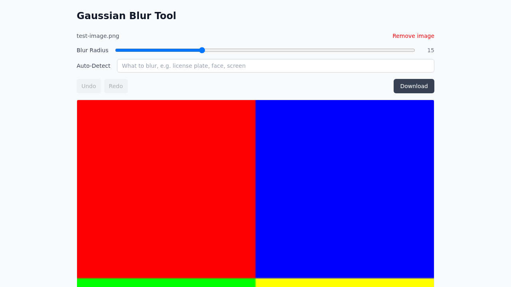
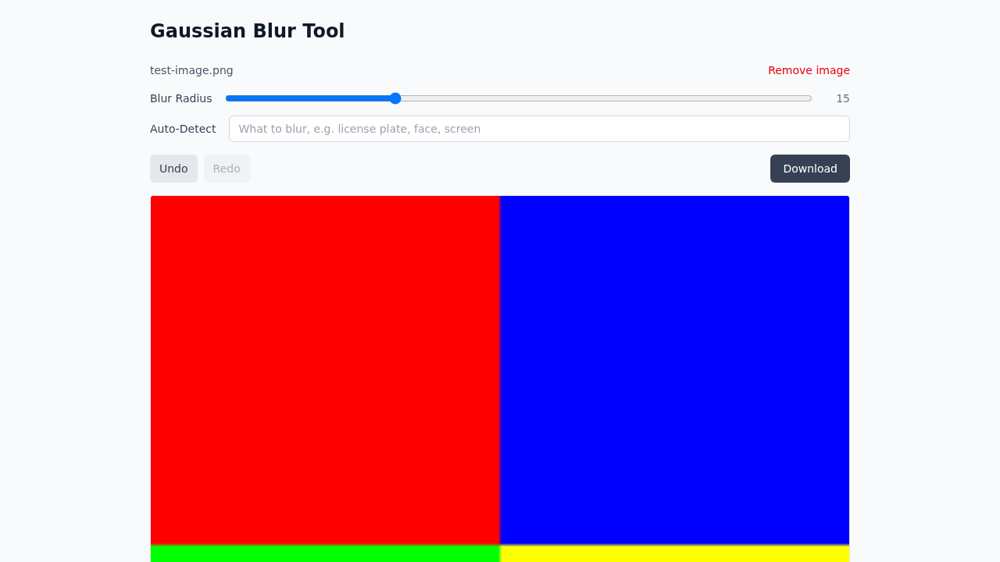
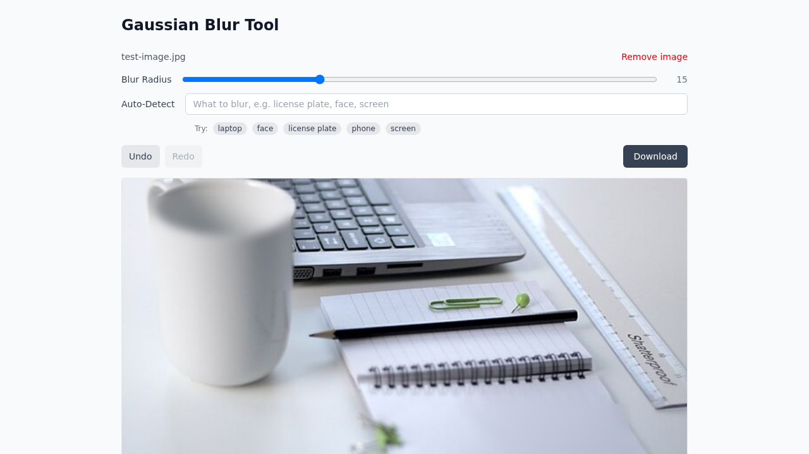

# Gaussian Blur Tool

A client-side image blur tool built with React, TypeScript, and Vite.

**[Try it live](https://milesburton.github.io/gaussian-blur-tool/)**

## Features

- **Drag-and-drop upload** — drop an image or click to browse
- **Region selection** — draw a box around the area to blur
- **Auto-detect objects** — type what to blur (e.g. "license plate", "face") and OWLv2 detects matching objects; click to blur individually or all at once
- **Multiple blur regions** — apply blur to different areas sequentially
- **Undo/redo** — step back through edits with toolbar buttons or `Ctrl+Z` / `Ctrl+Shift+Z`
- **Adjustable blur radius** — control blur intensity with a slider (1–50)
- **Download** — export the result as PNG

## Screenshots

### Landing page


### Image loaded with controls


### Blur applied


### Multiple regions blurred


### After undo


## Getting started

```bash
npm install
npm run dev
```

## Scripts

| Command | Description |
|---|---|
| `npm run dev` | Start dev server |
| `npm run build` | Type-check and build for production |
| `npm run preview` | Preview production build |
| `npm run lint` | Run Biome linter |
| `npm run test` | Run unit tests |
| `npm run test:watch` | Run unit tests in watch mode |
| `npm run test:coverage` | Run unit tests with coverage |
| `npm run test:e2e` | Run Playwright visual regression tests |
| `npm run test:e2e:update` | Update Playwright snapshots |

## Testing

### Unit tests (Vitest)

48 tests covering:

- Gaussian blur kernel generation and convolution
- Point-in-polygon ray casting algorithm
- Selection mask creation for rectangles and freeform shapes
- Blur application with selections
- Component rendering and interactions (DropZone, BlurControls)
- Undo/redo history hook
- Object detection query filtering

### E2E tests (Playwright)

12 visual regression and smoke tests:

- Landing page rendering
- Image upload with controls
- Blur selection and application
- Undo/redo workflows
- Multiple blur regions
- Blur radius adjustment
- Image removal
- Auto-detect query input, searching status, and detection round-trip

### Docker

All tests run in a containerised environment via CI:

```bash
docker build -t gaussian-blur-tool-test .
docker run --rm -e CI=true gaussian-blur-tool-test
```

## Tech stack

- React 19 + TypeScript 5.9
- Vite 8
- Tailwind CSS v4
- Hugging Face Transformers.js + OWLv2 (open-vocabulary object detection)
- Biome (linting/formatting)
- Husky + commitlint + lint-staged
- Vitest + Testing Library
- Playwright
